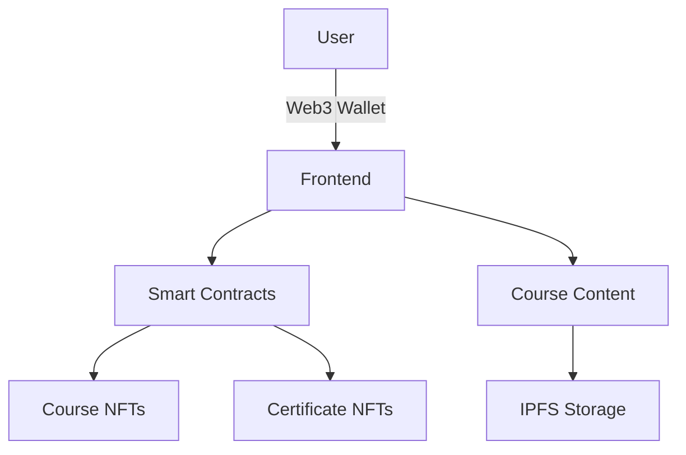

# SkillMint 🎓💎

> Decentralized Learning Platform: Earn, Learn, and Own Your Achievements

SkillMint is a revolutionary Web3-based skill learning platform where knowledge meets blockchain technology. Our platform enables creators to publish courses and learners to access quality education while earning verifiable credentials as NFTs.


## 🌟 Features

### For Learners
- 📚 Access diverse courses through cryptocurrency payments
- 🏆 Receive NFT certificates upon course completion
- 🔗 Verifiable credentials on the blockchain
- 👝 Integrated Web3 wallet for seamless transactions

### For Course Creators
- 💰 Set course prices in various cryptocurrencies
- 📊 Track engagement and earnings through analytics dashboard
- 🎨 Easy-to-use course creation interface
- 🤝 Direct connection with learners through blockchain

## 🛠️ Technology Stack

- **Frontend**: React.js, TailwindCSS
- **Smart Contracts**: Solidity
- **Blockchain**: Ethereum (& compatible networks)
- **NFT Standard**: ERC-721
- **Authentication**: Web3 wallet integration
- **Certificate Generation**: SVG templates with dynamic data

## 🏗️ Architecture



## 🚀 Getting Started

### Prerequisites
- Node.js v16+
- MetaMask or compatible Web3 wallet
- Git

### Installation

1. Clone the repository
```bash
git clone https://github.com/yourusername/skillmint.git
cd skillmint
```

2. Install dependencies
```bash
npm install
```

3. Set up environment variables
```bash
cp .env.example .env
# Edit .env with your configuration
```

4. Run the development server
```bash
npm run dev
```

## 💡 How It Works

1. **Course Creation**
   - Creators upload course content
   - Set pricing in preferred cryptocurrency
   - Content is stored on IPFS, with references on-chain

2. **Learning**
   - Learners browse available courses
   - Purchase using Web3 wallet
   - Access content and complete modules

3. **Certification**
   - Upon completion, smart contract mints NFT certificate
   - Certificate includes:
     - Course details
     - Completion date
     - Unique token ID
     - Learner's wallet address

## 👥 Team

- **Manisangh Sharma** - Full Stack Developer & Blockchain Architect
- **Riya Ranjan Jha** - Full Stack Developer
- **Aditya Monga** - Full Stack Developer

## 🏆 Hackathon Details

This project was created for Aurora, focusing on revolutionizing education through blockchain technology.

### Problem Statement
Traditional online learning platforms lack:
- Verifiable credentials
- Direct creator-learner economic relationship
- True ownership of achievements

### Our Solution
SkillMint addresses these issues by:
- Creating a Decentralised Platform to Learn
- Leveraging blockchain for transparent transactions
- Creating NFT certificates for verifiable achievements
- Enabling direct creator compensation

---

<p align="center">Built with 💚 by the MATRX Coders</p>
